# OmniClaw SDK — Complete Feature Reference

> **The Payment Infrastructure Layer for Autonomous AI Agents**
> One SDK. Three lines of code. Any agent framework.

---

## Architecture Overview

```mermaid
graph TB
    Agent["🤖 AI Agent / App"]
    Client["OmniClaw Client"]

    subgraph "Spend Controls"
        GM["GuardManager"]
        BG["BudgetGuard"]
        RLG["RateLimitGuard"]
        RG["RecipientGuard"]
        CG["ConfirmGuard"]
    end

    subgraph "2-Phase Commit"
        Facade["IntentFacade"]
        IS["IntentService"]
        RS["ReservationService"]
        FL["FundLockService"]
    end

    subgraph "Routing & Protocols"
        Router["PaymentRouter"]
        TA["TransferAdapter"]
        X4["X402Adapter"]
        GA["GatewayAdapter (CCTP)"]
    end

    subgraph "Resilience"
        CB["CircuitBreaker"]
        RT["RetryPolicy"]
    end

    subgraph "Infrastructure"
        Ledger["Ledger"]
        Storage["StorageBackend"]
        Redis["Redis"]
        Memory["InMemory"]
        WS["WalletService"]
        Circle["Circle API"]
    end

    Agent --> Client
    Client --> GM
    Client --> Facade
    Client --> Router
    Client --> CB

    GM --> BG & RLG & RG & CG

    Facade --> IS & RS & FL

    Router --> TA & X4 & GA
    TA & X4 & GA --> WS
    WS --> Circle

    CB --> RT

    IS & RS & FL & Ledger & BG & RLG --> Storage
    Storage --> Redis & Memory
```



---

## 1. Setup & Initialization

### One-Call Setup
```python
from omniclaw.onboarding import quick_setup

result = quick_setup("sk_test_YOUR_CIRCLE_API_KEY")
# Creates: .env file + recovery file in ~/.config/omniclaw/
```

**What happens internally:**
1. `generate_entity_secret()` → generates 32-byte hex secret
2. `register_entity_secret()` → registers with Circle API, saves recovery `.dat` file
3. `create_env_file()` → writes `CIRCLE_API_KEY` and `ENTITY_SECRET` to `.env`

### Client Initialization
```python
from omniclaw import OmniClaw, Network

async with OmniClaw(network=Network.ETH_SEPOLIA) as client:
    # Ready to go
    ...
```

**What `OmniClaw.__init__()` wires up:**

| Component | Purpose |
|-----------|---------|
| `Config` | Loads from env vars or constructor args |
| `CircleClient` | Low-level Circle API wrapper |
| `WalletService` | Wallet management (create, list, balance, transfer) |
| `StorageBackend` | Redis (production) or InMemory (testing) |
| `PaymentRouter` | Routes to TransferAdapter, X402Adapter, GatewayAdapter |
| `GuardManager` | Per-wallet guard chain management |
| `FundLockService` | Wallet-level mutex locking |
| `ReservationService` | Fund reservations for pending intents |
| `PaymentIntentService` | Intent persistence and lifecycle |
| `PaymentIntentFacade` | `client.intent.create/confirm/cancel` API |
| `Ledger` | Immutable audit trail |
| `CircuitBreaker` | Resilience for Circle API calls |
| `BatchProcessor` | Concurrent batch payments |
| `WebhookParser` | Ed25519 signature verification |

---

## 2. Wallet Management

```python
# Create a wallet set + wallet
wallet_set, wallet = client.wallet.create_agent_wallet("my-agent")

# Or manually
ws = client.create_wallet_set("production-wallets")
w = client.create_wallet(wallet_set_id=ws.id, blockchain=Network.ETH_SEPOLIA)

# Check balance
balance = await client.get_balance(wallet.id)  # Returns Decimal

# List
wallets = client.list_wallets(wallet_set_id=ws.id)
transactions = client.list_transactions(wallet_id=wallet.id)
```

**Key methods:**

| Method | What it does |
|--------|-------------|
| `create_agent_wallet(name)` | Creates wallet set `agent-{name}` + wallet |
| `create_user_wallet(user_id)` | Creates wallet set `user-{id}` + wallet |
| `create_wallets(set_id, count)` | Batch create 1-20 wallets |
| `get_usdc_balance(wallet_id)` | Returns `Balance(amount, token)` |
| `transfer(wallet_id, dest, amount)` | Direct USDC transfer |

---

## 3. Payment Execution (`client.pay()`)

The core payment method. Handles everything automatically.

```python
result = await client.pay(
    wallet_id="wallet-123",
    recipient="0x742d35Cc6634C0532925a3b844Bc9e7595f5e4a0",
    amount="50.00",
    purpose="Pay for API access",
)

print(result.success)         # True
print(result.transaction_id)  # "tx-abc123"
print(result.status)          # PaymentStatus.COMPLETED
print(result.guards_passed)   # ["budget", "rate_limit"]
```

### Execution Pipeline (10 steps)

```mermaid
sequenceDiagram
    participant Agent
    participant Client as client.pay()
    participant Guards as GuardChain
    participant Lock as FundLock
    participant CB as CircuitBreaker
    participant Router
    participant Adapter
    participant Ledger

    Agent->>Client: pay(wallet, recipient, amount)
    Client->>Ledger: 1. Create ledger entry (PENDING)
    Client->>Guards: 2. reserve(context)
    Guards-->>Client: guard_tokens
    Client->>Lock: 3. acquire(wallet) → lock_token
    Client->>Client: 4. Check balance - reservations ≥ amount
    Client->>CB: 5. async with circuit:
    CB->>Router: 6. Route to adapter
    Router->>Adapter: 7. execute(wallet, recipient, amount)
    Adapter-->>Router: PaymentResult
    Router-->>CB: result
    CB-->>Client: result
    Client->>Guards: 8. commit(guard_tokens) or release()
    Client->>Ledger: 9. Update entry (COMPLETED/FAILED)
    Client->>Lock: 10. release_with_key(wallet, lock_token)
    Client-->>Agent: PaymentResult
```



### Resilience Strategies

```python
# Default: retry on transient errors, then fail
result = await client.pay(..., strategy="retry_then_fail")

# Fail immediately on any error
result = await client.pay(..., strategy="fail_fast")

# Queue for background processing if circuit is open
result = await client.pay(..., strategy="queue_background")
```

| Strategy | On Transient Error | On Circuit Open |
|----------|-------------------|-----------------|
| `retry_then_fail` | Retry 5x with exponential backoff (1→2→4→8→16s) | Raise `CircuitOpenError` |
| `fail_fast` | Fail immediately | Raise `CircuitOpenError` |
| `queue_background` | Fail immediately | Create intent + reserve funds |

---

## 4. Payment Simulation (`client.simulate()`)

Dry-run of the full pipeline — **no money moves**.

```python
sim = await client.simulate(
    wallet_id="wallet-123",
    recipient="https://api.openai.com/v1/chat",
    amount="25.00",
)

print(sim.would_succeed)       # True
print(sim.estimated_gas)       # Decimal("0.01")
print(sim.guards_that_pass)    # ["budget", "rate_limit"]
print(sim.recipient_type)      # "x402"
print(sim.route)               # PaymentMethod.X402
print(sim.reason)              # None (or "Insufficient balance")
```

**What simulate checks:**
1. ✅ Balance ≥ amount (considering existing reservations)
2. ✅ All guards would pass (budget, rate limit, recipient, confirm)
3. ✅ Router can find an adapter for the recipient
4. ✅ Adapter-specific checks (address format, balance for transfers)

---

## 5. Payment Intents (2-Phase Commit)

Stripe-like authorize/capture flow.

```python
# Phase 1: Create intent → reserves funds
intent = await client.intent.create(
    wallet_id="wallet-123",
    recipient="https://api.expensive-model.com",
    amount="50.00",
    purpose="Run LLM inference",
    expires_in=300,  # 5 minutes
)
print(intent.status)          # "requires_confirmation"
print(intent.reserved_amount) # Decimal("50.00")

# Phase 2a: Confirm → executes payment
result = await client.intent.confirm(intent.id)

# Phase 2b: Or cancel → releases reservation
cancelled = await client.intent.cancel(intent.id, reason="User declined")
```

### Safety Features
- **Fund Reservation**: Creating an intent locks the funds so no other payment can spend them
- **Expiry**: Expired intents auto-cancel when confirmed, releasing reserved funds
- **Double-Confirm Protection**: Can't confirm an intent that's already been confirmed or cancelled
- **Status Validation**: Can only cancel intents in `REQUIRES_CONFIRMATION` status

### Intent Lifecycle


---

## 6. Guard System (Spend Controls)

Guards are composable rules that run before every payment.

```python
from omniclaw import BudgetGuard, RateLimitGuard, RecipientGuard, ConfirmGuard
from decimal import Decimal

# Set guards per wallet
client.guards.set("wallet-123", [
    BudgetGuard(daily_limit=Decimal("100.00"), hourly_limit=Decimal("25.00")),
    RateLimitGuard(max_per_minute=5, max_per_hour=50),
    RecipientGuard(mode="whitelist", domains=["openai.com", "anthropic.com"]),
    ConfirmGuard(threshold=Decimal("50.00"), confirm_callback=my_callback),
])
```

### Guard Types

#### BudgetGuard
Controls **how much** can be spent.
- `daily_limit` — Rolling 24-hour cap
- `hourly_limit` — Rolling 1-hour cap
- `total_limit` — Lifetime cap
- Uses atomic reserve/commit/release for consistency

#### RateLimitGuard
Controls **how often** payments happen.
- `max_per_minute` / `max_per_hour` / `max_per_day`
- Uses atomic counters on time-windowed storage keys
- `check()` reports accurate counts for simulation

#### RecipientGuard
Controls **who** gets paid.
- `mode="whitelist"` — Only explicitly allowed recipients
- `mode="blacklist"` — All except blocked recipients
- Matches by: exact address, domain substring, regex pattern

#### ConfirmGuard
Requires **human approval** above a threshold.
- `threshold` — Amount above which confirmation is required
- `always_confirm` — Require confirmation for all payments
- `confirm_callback` — Async function for programmatic approval

### Guard Pipeline (Reserve/Commit/Release)

```
check()   → Pre-flight (non-atomic read, used by simulate)
reserve() → Atomic allocation (increment counters, check limits)
commit()  → Finalize (no-op for most guards, already counted on reserve)
release() → Rollback (decrement counters if payment fails)
```

---

## 7. Fund Locking (Wallet Mutex)

Prevents race conditions when multiple agents share a wallet.

```mermaid
sequenceDiagram
    participant A as Agent A
    participant Lock as FundLockService
    participant B as Agent B

    A->>Lock: acquire("wallet-1") → token_A
    Note over Lock: Locked (TTL: 30s)
    B->>Lock: acquire("wallet-1") → retry...retry...None
    Note over B: Failed after 3 retries

    A->>Lock: release_with_key("wallet-1", token_A)
    Note over Lock: Unlocked

    B->>Lock: acquire("wallet-1") → token_B ✓
```



**Token-based ownership**: Only the acquirer can release the lock. Uses UUID tokens validated via Lua script (Redis) or dict check (Memory).

---

## 8. Reservation Service

Second layer of locking — reserves funds for pending intents.

```python
# Internal usage (automatically called by intent.create):
await reservation.reserve("wallet-1", Decimal("50.00"), "intent-abc")

# Available balance calculation:
available = balance - await reservation.get_reserved_total("wallet-1")
```

Both `simulate()` and `pay()` subtract reservations from available balance, preventing double-spending across concurrent intents.

---

## 9. Resilience Stack

### Circuit Breaker

Wraps Circle API calls. Prevents cascading failures.

```mermaid
stateDiagram-v2
    [*] --> CLOSED: Normal operation
    CLOSED --> OPEN: ≥5 failures (threshold)
    OPEN --> HALF_OPEN: After recovery_timeout (30s)
    HALF_OPEN --> CLOSED: Success
    HALF_OPEN --> OPEN: Failure (immediate re-trip)
    note right of CLOSED: Success decrements\nfailure count by 1\n(gradual recovery)
```



**Usage inside `client.pay()`:**
```python
async with self._circuit_breaker:
    result = await self._router.pay(...)
# Clean exit → record_success() → decrement failures
# Exception  → record_failure() → may trip circuit
```

### Retry Policy

Tenacity-based exponential backoff. Only retries **transient** errors.

| Attempt | Wait | Total Elapsed |
|---------|------|---------------|
| 1 | 0s | 0s |
| 2 | 1s | 1s |
| 3 | 2s | 3s |
| 4 | 4s | 7s |
| 5 | 8s | 15s |

**Transient errors** (retried): timeout, connection refused, 500/502/503/504, network error, rate limit.

**Business errors** (not retried): insufficient balance, invalid address, guard violations.

---

## 10. Protocol Adapters (Routing)

The `PaymentRouter` detects the recipient type and routes to the correct adapter.

```python
# Blockchain address → TransferAdapter
await client.pay(..., recipient="0x742d35Cc6634C0532925a3b844Bc9e7595f5e4a0")

# URL → X402Adapter
await client.pay(..., recipient="https://api.openai.com/v1/chat")

# Cross-chain → GatewayAdapter
await client.pay(..., recipient="0xabc...", destination_chain=Network.ARB_SEPOLIA)
```

### TransferAdapter (Priority: 50)
- **Detects**: EVM addresses (`0x...40 hex chars`) and Solana addresses (Base58)
- **Executes**: Direct USDC transfer via Circle Wallet API
- **Simulates**: Checks address format + balance

### X402Adapter (Priority: 10)
- **Detects**: HTTP/HTTPS URLs
- **Executes**: Probe URL → parse 402 response → sign payment → retry with proof
- **Supports**: V1 (X-Payment header) and V2 (PAYMENT-SIGNATURE header)
- **Simulates**: Probes URL to check if it requires payment + estimated cost

### GatewayAdapter (Priority: 30)
- **Detects**: Any recipient when `destination_chain` is specified
- **Executes**: Circle CCTP V2 cross-chain transfer (approve → burn → attestation → mint)
- **Same-chain fallback**: Delegates to `WalletService.transfer()` if source == destination
- **Simulates**: Checks CCTP network support + balance

---

## 11. Ledger (Audit Trail)

Every payment is recorded immutably.

```python
# Get ledger
entry = await client.ledger.get(entry_id)

# Query
entries = await client.ledger.query(
    wallet_id="wallet-123",
    status="completed",
    limit=50,
)

# Sync with blockchain
entry = await client.sync_transaction(entry_id)
```

**LedgerEntry fields**: `id`, `wallet_id`, `recipient`, `amount`, `status`, `method`, `transaction_id`, `blockchain_tx`, `guards_passed`, `metadata`, `created_at`, `updated_at`.

---

## 12. Webhook Verification

Parse and verify Circle webhook events.

```python
parser = client.webhooks  # or WebhookParser(verification_key="...")

event = parser.handle(
    payload=request.body,
    headers=request.headers,
)

print(event.type)       # NotificationType.PAYMENT_COMPLETED
print(event.data)       # {...notification data...}
print(event.timestamp)  # datetime (from customDate or now)
```

**Signature verification**: Ed25519 signatures using `x-circle-signature` header. Supports PEM, Hex, and Base64 key formats.

---

## 13. Batch Payments

Execute multiple payments concurrently.

```python
from omniclaw import PaymentRequest

results = await client.batch_pay(
    requests=[
        PaymentRequest(wallet_id="w1", recipient="0xabc", amount=Decimal("10")),
        PaymentRequest(wallet_id="w1", recipient="0xdef", amount=Decimal("20")),
        PaymentRequest(wallet_id="w2", recipient="0xghi", amount=Decimal("5")),
    ],
    concurrency=5,  # Max parallel executions
)

print(results.total)      # 3
print(results.succeeded)  # 2
print(results.failed)     # 1
```

---

## 14. Storage Backends

All stateful components (guards, ledger, locks, reservations, circuit breaker) persist to a pluggable storage backend.

| Backend | When | Trade-off |
|---------|------|-----------|
| `InMemoryStorage` | Tests, single-process dev | Fast, no dependencies, lost on restart |
| `RedisStorage` | Production, multi-agent | Distributed, persistent, atomic ops |

**Key operations**: `save()`, `get()`, `update()`, `delete()`, `acquire_lock()`, `release_lock()`, `atomic_add()`.

Auto-selected: Redis if `REDIS_URL` env var is set, otherwise InMemory.

---

## 15. ERC-8004 Trust Gate & Agent Identity

OmniClaw implements the [ERC-8004 Trustless Agents](https://eips.ethereum.org/EIPS/eip-8004) standard for on-chain agent identity verification and reputation scoring. The Trust Gate evaluates recipient agents before payments are executed.

### Trust Gate Pipeline


### Policy Presets

```python
from omniclaw.identity.types import TrustPolicy

TrustPolicy.permissive()  # Pass most, block only known fraud
TrustPolicy.standard()    # Hold new/unverified agents, min WTS=50
TrustPolicy.strict()      # Enterprise: WTS≥70, KYB required, high-value WTS=85
```

### 10-Check Policy Engine

| Priority | Check | On Fail |
|----------|-------|---------|
| 1 | Address blocklist | `BLOCKED` |
| 2 | Org whitelist | Skip remaining → `APPROVED` |
| 3 | Identity required | `HELD` or `BLOCKED` |
| 4 | Fraud tag detected | `BLOCKED` |
| 5 | New agent (<3 signals) | Configurable |
| 6 | Min feedback count | `HELD` |
| 7 | Min WTS threshold | `HELD` |
| 8 | High-value WTS | `HELD` (for large payments) |
| 9 | Missing attestations | `HELD` |
| 10 | All pass | `APPROVED` |

### Weighted Trust Score (WTS) Algorithm

1. **Filter self-reviews** — Agent's own feedback excluded
2. **Recency decay** — Index-based: 67%+ → 1.0x, 33-67% → 0.5x, <33% → 0.2x
3. **Verified submitter boost** — 1.5x weight for registered agents
4. **Fraud tag detection** — `fraud`, `scam`, `malicious`, `spam`, `phishing`
5. **Weighted average** — normalized_score × weight / total_weight → 0-100
6. **Min sample guard** — <3 signals → `new_agent` flag

### Identity Resolution

Resolves on-chain identity from the ERC-8004 Identity Registry (ERC-721) and fetches off-chain registration files via:

| URI Scheme | Method |
|-----------|--------|
| `https://` | `httpx` fetch |
| `ipfs://` | Gateway fallback (3 gateways) |
| `data:application/json;base64,...` | Base64 decode |

### ERC-8004 Registry Coverage

| Registry | Functions | Status |
|----------|----------|--------|
| Identity (ERC-721 + extensions) | 13 | ✅ Complete |
| Reputation (Feedback + Scoring) | 10 | ✅ Complete |
| Validation (Request/Response) | 5 | ✅ ABI ready |

**28 total selectors** — all keccak256-verified. Deployed on ETH Mainnet and Base/ETH Sepolia.

### Cache TTLs

| Data Type | TTL |
|-----------|-----|
| Identity | 5 min |
| Reputation | 2 min |
| Metadata | 10 min |
| Policy | 60 min |

---

## 16. Supported Networks

```python
from omniclaw import Network

# EVM
Network.ETH_SEPOLIA      # Ethereum Sepolia testnet
Network.ETH              # Ethereum mainnet
Network.ARB_SEPOLIA       # Arbitrum Sepolia testnet
Network.ARB              # Arbitrum mainnet
Network.MATIC_AMOY        # Polygon Amoy testnet
Network.MATIC            # Polygon mainnet
Network.ARC_TESTNET       # Arc testnet (gasless)
Network.BASE_SEPOLIA      # Base Sepolia testnet
Network.BASE             # Base mainnet

# Solana
Network.SOL_DEVNET        # Solana devnet
Network.SOL              # Solana mainnet

# CCTP V2 Cross-Chain Support
# ETH ↔ ARB ↔ BASE ↔ MATIC ↔ ARC (all directions)
```

---

## Test Coverage

| Module | Tests | What's Covered |
|--------|-------|----------------|
| `test_client.py` | 14 | Init, guards, simulation, detect_method |
| `test_circuit_breaker.py` | 10 | Full lifecycle, context manager, recovery |
| `test_intent_lifecycle.py` | 9 | Facade API, expiry, double-spend prevention |
| `test_gateway.py` | 14 | Routing, execute, simulate, executor wallet |
| `test_simulation.py` | 3 | Fields, reservations, guards |
| `test_payment_intents.py` | 6 | Double-spend, cancel, create |
| `test_fund_lock.py` | 4 | Token ownership, TTL, retry |
| `test_guards.py` | 56 | All guard types + chain |
| `test_payment_concurrency.py` | 1 | Concurrent budget enforcement |
| `test_wallet_service.py` | 60 | Full wallet API |
| `test_trust_gate.py` | 42 | Policy, scoring, cache, identity, ABI, endpoint verification |
| `test_trust_gate_integration.py` | 59 | 11 real-world ERC-8004 scenarios |
| Others | 103 | Ledger, router, webhooks, x402, config, types |
| **Total** | **381** | |

